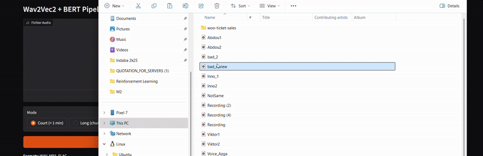

# Pipeline Wav2Vec2 + BERT

Analyse de sentiment d'appels vocaux : Audio → Transcription → Sentiment

## Modeles Hugging Face

### Wav2Vec2 (Transcription)
- [`facebook/wav2vec2-large-960h-lv60-self`](https://huggingface.co/facebook/wav2vec2-large-960h-lv60-self) - Multilingue

### BERT (Sentiment)
- [`nlptown/bert-base-multilingual-uncased-sentiment`](https://huggingface.co/nlptown/bert-base-multilingual-uncased-sentiment) - Multilingue

## Installation

```bash
# Cloner le projet
git clone <repo>
cd pipeline

# Installer les dépendances
pip install -r requirements.txt

# Lancer l'interface
python app.py
```

## Utilisation

1. Lancer `python app.py`
2. Ouvrir le lien affiché (http://127.0.0.1:7860)
3. Uploader un fichier audio (WAV, MP3, FLAC)
4. Choisir le mode (Court/Long)
5. Cliquer "Analyser"

## Résultats

- **Transcription** : Texte converti depuis l'audio
- **Sentiment** : Positif/Négatif/Neutre
- **Confiance** : Score de fiabilité
- **Distribution** : Répartition par segments (mode long)

## Formats supportés

- **Audio** : WAV (recommandé), MP3, FLAC, OGG
- **Durée** : Illimitée (découpage automatique > 1min)
- **Qualité** : 16kHz minimum recommandé

